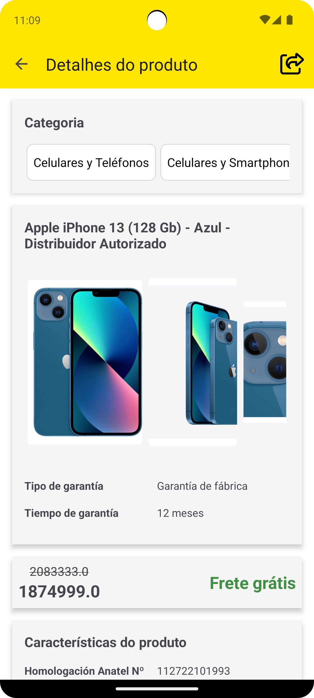

# Mercado Libre Mobile Candidate

Projeto desenvolvido durante processo seletivo para a vaga **Android  Developer  Senior**, cujo objetivo é desenvolver uma aplicação utilizando as APIs do Mercado Livre permitindo ao usuário pesquisar e visualizar detalhes de um produto.

[Requisitos](/gitassets/requirements/requirements.md)

**Observação:**  Foram utilizados os arquivos JSON fornecidos para o desenvolvimento, pois não foi possível configurar uma *redirect URI* sem HTTPS no [Dev Center](https://developers.mercadolivre.com.br/devcenter/new-list-app). Sendo assim, não é possível implementar OAuth 2.0 diretamente sem auxílio de um *middleware*.

## Funcionalidades
- Busca de produtos a partir da barra de pesquisa
- Histórico de pesquisa
- Listagem dos resultados 
  - Título
  - Preço
  - Frete grátis
- Detalhes do produto
  - Categoria
  - Título
  - Imagens em carrossel horizontal
  - Garantia
  - Preço
  - Frete grátis
  - Características
  - Descrição
- Compartilhar link do produto

## Arquitetura

O projeto seguiu os princípios da *Clean Architecture* combinados com o padrão MVVM (Model-View-ViewModel). A aplicação foi organizada em camadas e separadas por módulos:
- **domain**  
  - Contém as entidades de domínio
  - Define a interface do repositório
- **data**  
  - Contém os *Data Transfer Objects* (DTOs)
  - Implementa o repositório definido na camada de *domain*
  - Define a interface da API
  - Implementa a interface responsável por fornecer os arquivos JSON mockados
  - Desacoplada, aguardando implementação do *Retrofit* ou outro *client*
- **app**
  - Apresentação (UI) implementada em XML
  - *ViewModels* para abstrair a lógica das *Activities/Fragments*
  - *Hilt* para injeção de dependências

## Testes
### Testes instrumentados (Android Test)

- JUnit4
- Expresso

Foram implementados testes instrumentados com foco nos principais fluxos da aplicação (caminho feliz).

---

### Testes unitários (Unit Test)

- JUnit
- Coroutines
- Mockk
- Turbine

Foram implementados testes unitários cobrindo todos os *ViewModels* fazendo o uso da biblioteca **Turbine** para observar os estados do *StateFlow*. E, testes de todas as chamadas do repositório, simulando os retornos utilizando **mockk**.

---

### JaCoCo

Para mapear a abrangência dos testes realizados foi configurado a biblioteca em questão no projeto e criado um *script* para executar os testes instrumentados e unitários emitindo um relatório ao final.

Rodar os testes:

    ./gradlew jacocoFullReport

Relatório estará em:

    ./app/build/reports/jacoco/jacocoFullReport

Há um relatório salvo no repositório que pode ser visualizado sem rodar os testes:

    ./gitassets/jacoco/jacocoFullReport/html/index.html

---

## Como rodar

### Pré-requisitos

- Android Studio
- JDK 17
- Emulador ou dispositivo Android com API 29 (Android 10) ou superior

---

### Passo a passo

1. Clone o repositório
2. Abra o projeto utilizando o Android Studio
3. Aguarde a sincronização do Gradle
4. Rode o projeto

---

## Ferramentas / Dependências

### App

- AndroidX Core
- AndroidX Activity e Fragment
- AndroidX Lifecycle
- AndroidX AppCompat
- Material Design
- Retrofit
- Gson Converter
- Hilt
- Glide
- JaCoCo

---

### Testes

- JUnit
- MockK
- Turbine
- Kotlin Coroutines Test
- Espresso

---

## Capturas de tela

	
	
    

## Autor
- Christian Alberton Alexandre
  - [Linkedin](https://www.linkedin.com/in/christian-alexandre/)
